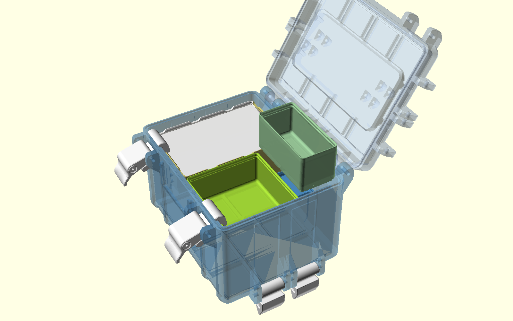
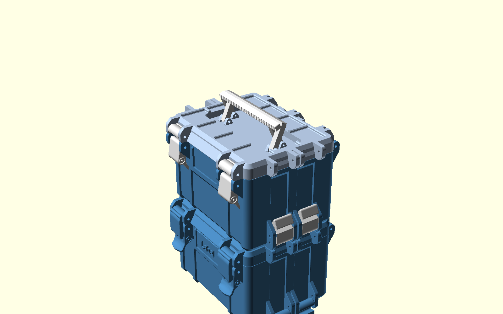
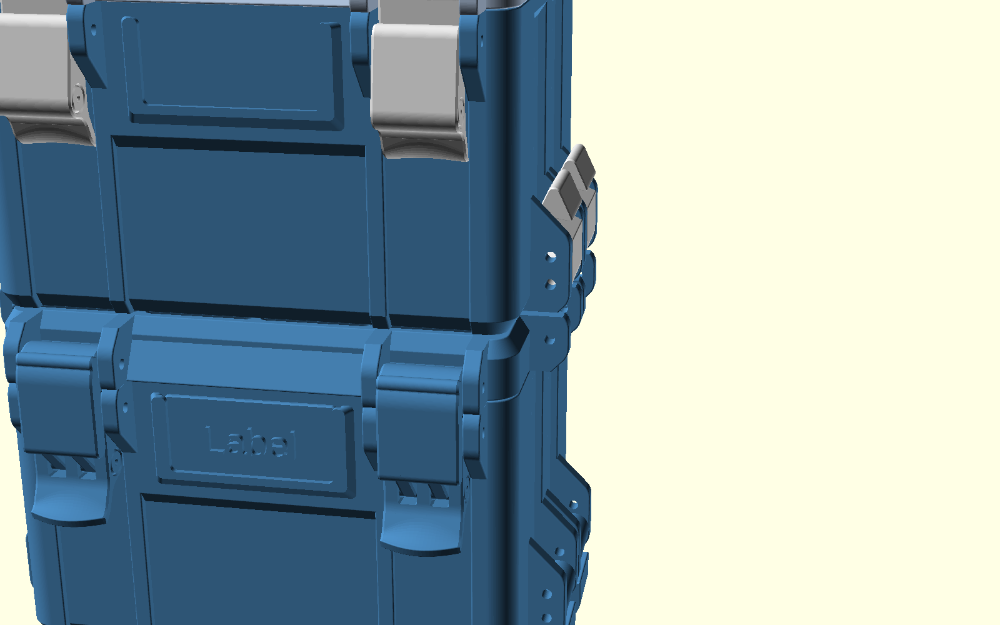

# Gridfinity Case System

A fork of [smkent/monoscad](https://github.com/smkent/monoscad) focused on
the [Gridfinity Rugged Storage Box](gridfinity/rugged-box/): a stackable,
latching, parametric OpenSCAD case system for Gridfinity bins, extended
into a complete carry system rated for **~5 kg per case and 15-25 kg per
stack**.


*One-turn overview → lid opens → two layers of bins and a removable level
tray go in → a second case stacks below and locks → the split lid handle
rises into its self-clamping X-arch and lifts the stack.*

## Fork additions



* **Lid carry handle** recessed into the center of the lid — folded, it
  stays below the stacking plane, so cases still stack and latch on top.
  Two styles: a single fold-flat bail, or the **split X-arch** (two
  identical half-bails on central axes whose grip bars press together
  under load; four pivots, level carry on every case size).
* **Heavy-duty attachments**: M4 screws with enlarged eyelets and latch
  bodies, a third hinge from 3 units wide, and optional stacking latches
  at every grid boundary.
* **Removable level tray**: a baseplate tray with Gridfinity feet that
  turns bin layers into liftable levels; fold-flat pull bails hide below
  the bin seating plane, all-printed pivots.
* **Hardware-friendly options**: hex nut pockets (screws clamp with nuts,
  no thread-forming); **axle sleeves** — printed 8 mm bearing sleeves
  retained by two short M4x12..20 screws, so no screws longer than 20 mm
  are needed anywhere and rotating parts never ride on threads.
* **Silicone cord seal**: a dovetail groove in the bottom lip for 2-4 mm
  cord, with snap-in retention and self-limited ~25% compression.
* **Bins**: plain stackable bins and sliding-lid bins (from
  [gridfinity/lid-bins](gridfinity/lid-bins/)) compose with the cases;
  equal-height bins act as a baseplate for the next layer.




See [gridfinity/rugged-box/README.md](gridfinity/rugged-box/README.md) for
option documentation, load-path rationale, hardware lists, and print
guidance. A full pre-rendered STL kit for 260mm printers (5x5 case, 90
bins, 90 lidded bins, level tray) is generated under
`gridfinity/rugged-box/build/` (see the manifest there; the video is
`images/fork/demo.mp4`).

---

# My OpenSCAD models for 3D printing

[![bulbasaur0 on Printables][printables-profile-badge]][printables-profile]

A monorepository for my [OpenSCAD][openscad] models and remixes. Print-ready
models are also [published on Printables][printables-profile].

## Setup

Models in this repository depend on various
[third-party libraries][openscad-libraries], which are provided as
[git submodules][git-submodules] using
[smkent/openscad-libraries][smkent-openscad-libraries].

After cloning this repository, install all third-party libraries by running in
the repository directory:

```console
git submodule update --init --recursive
```

## Rendering models via CLI

Each model has preconfigured renders to be created via the
[OpenSCAD CLI][openscad-cli] using [SCons][scons].
Model STL files published to Printables are rendered this way.

SCons is a Python package and can be installed using `pip`:

```console
pip install --user scons
```

To build the configured model renders for a particular model, change to the
desired model directory and run:

```console
scons -u
```

Rendered models will be placed in a `build` subdirectory within the model
directory.

## Model samples

Click an image to view the corresponding model, or browse subdirectories for all
models.

[](gridfinity/rugged-box/)
[](rugged-box/)
[](gridfinity/lid-bins/)
[](modular-hose/)
[](bosch-custom-case/bit-clips/)
[](stargate/)

## License

### Models

Each model in this repository is licensed individually, especially for remixes
which must maintain compatible licensing with their original model(s).

See `README.md` and/or any `LICENSE` files within a model's subdirectory for
that model's license.

### Third party libraries

Third party libraries have their own licenses.

### Monorepository

All remaining contents of this repository (i.e. not models or third party
libraries) are licensed under [Creative Commons (4.0 International License)
Attribution][license-cc-by-4.0].


[git-submodules]: https://git-scm.com/book/en/v2/Git-Tools-Submodules
[license-cc-by-4.0]: http://creativecommons.org/licenses/by/4.0/
[openscad-cli]: https://en.wikibooks.org/wiki/OpenSCAD_User_Manual/Using_OpenSCAD_in_a_command_line_environment
[openscad-libraries]: https://en.wikibooks.org/wiki/OpenSCAD_User_Manual/Libraries
[openscad]: https://openscad.org
[printables-profile-badge]: /_static/printables-profile-badge.svg
[printables-profile]: https://www.printables.com/@bulbasaur0/models
[scons]: https://scons.org/
[smkent-openscad-libraries]: https://github.com/smkent/openscad-libraries
